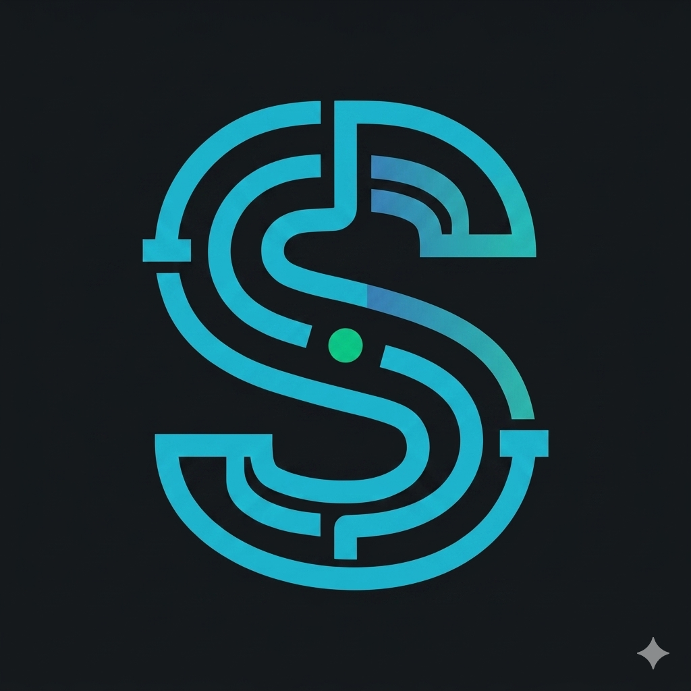

<p align="center">
  
</p>

# Shipyard — Frontend

[](http://useshipyard.xyz)
[](LICENSE)

The dashboard frontend for Shipyard, a CI/CD deployment pipeline. Built with Next.js 16, React 19, and Tailwind CSS v4.

## Features

- **GitHub OAuth** — Sign in with GitHub, token-based session with Zustand persistence
- **Project Dashboard** — Grid/list view of all projects with build status badges, deployment info, and error previews
- **New Project Flow** — Browse GitHub orgs and repos, search repos, configure build settings, add environment variables, deploy with one click
- **Real-time Build Logs** — Terminal-style console streaming build output line by line via Socket.io as Docker containers run
- **Project Management** — View build history, deployment history, update settings, manage secrets, delete projects (with GitHub webhook cleanup)
- **Rebuild & Rollback** — Trigger rebuilds from the top bar, rollback to previous deployments from the deployments tab
- **Profile Management** — Update username and email
- **Logout** — Clear session and disconnect socket
- **Responsive** — Mobile-friendly with collapsible sidebar

## Pages

**Landing Page** — Hero section, feature highlights, how-it-works steps, CTA with GitHub OAuth sign-in modal.

**Auth Callback** — Receives OAuth token and user data from backend redirect, stores in Zustand, redirects to dashboard.

**Dashboard** — Overview of all connected projects with build status, deployment timestamps, error previews. Grid and list view toggle. Empty state for new users.

**New Project** — Split layout. Left: organization selector (personal account + GitHub orgs), repo browser with search, 5 most recent repos. Right: auto-filled project config (name, branch, install command, build command, output directory), environment variables with add/remove. Deploy bar with loading state.

**Project Detail** — Tabbed view with Builds (history with status, commit, timestamps), Deployments (live/rolled back status, rollback button), and Settings (update build config, manage secrets, danger zone with project deletion). Sidebar shows production URL, build time usage metrics, and notifications.

**Deployment Detail** — Build metadata (commit message, branch, hash, timestamp, author avatar). Health status with progress bar. Full-screen terminal console with real-time log streaming, auto-scroll, line numbers, color-coded log types, and clickable deployment URLs.

**Profile** — View username and email.

## Tech Stack

- **Framework:** Next.js 16 (App Router)
- **UI:** React 19
- **Styling:** Tailwind CSS v4
- **Icons:** Lucide React
- **State Management:** Zustand (auth + project state with persistence)
- **Server State:** TanStack React Query (data fetching, mutations, cache invalidation)
- **HTTP Client:** Axios (with JWT interceptor)
- **Real-time:** Socket.io Client (build log streaming, build and deployment status update)
- **Date Formatting:** date-fns

## Project Structure

```
app/
├── (landing)/
│   ├── layout.tsx               # Landing page layout with navbar + footer
│   ├── page.tsx                 # Landing page
│   └── auth/
│       └── callback/
│           └── page.tsx         # OAuth callback handler
├── (dashboard)/
│   └── dashboard/
│       ├── layout.tsx           # Dashboard layout with sidebar + top bar + socket provider
│       ├── page.tsx             # Projects overview
│       ├── new/
│       │   └── page.tsx         # New project setup
│       ├── projects/
│       │   └── [id]/
│       │       └── page.tsx     # Project detail (builds, deployments, settings)
│       ├── deployments/
│       │   └── [id]/
│       │       └── page.tsx     # Build log terminal view
│       └── profile/
│           └── page.tsx         # User profile 

components/
├── auth/
│   └── auth-modal.tsx           # GitHub OAuth sign-in modal
├── landing/
│   ├── hero.tsx                 # Hero section
│   ├── features.tsx             # Feature highlights grid
│   ├── steps.tsx                # How it works steps
│   └── cta.tsx                  # Call to action section
├── dashboard/
│   ├── sidebar.tsx              # Navigation sidebar with logout
│   ├── sidebar-link.tsx         # Sidebar nav item
│   ├── top-bar.tsx              # Search bar, new project button, rebuild, user avatar
│   ├── footer.tsx               # Dashboard footer
│   ├── dashboard-skeleton.tsx   # Loading skeleton
│   ├── components/
│   │   └── project-card.tsx     # Project card with status badge and error preview
│   ├── new/
│   │   ├── left-section.tsx     # Org selector + repo browser with search
│   │   ├── right-section.tsx    # Configuration form + env variables
│   │   ├── organization-select.tsx  # GitHub org/account dropdown
│   │   ├── repo-item.tsx        # Repo list item
│   │   ├── repo-skeleton.tsx    # Repo loading skeleton
│   │   ├── build-input.tsx      # Build config input field
│   │   └── deployment-bar.tsx   # Fixed deploy button bar
│   ├── deployments/
│   │   ├── terminal-console.tsx # Real-time build log terminal (expandable)
│   │   └── log-line.tsx         # Individual log line with type coloring and URL detection
│   └── project/
│       ├── build-row.tsx        # Build history row (clickable for running builds)
│       ├── deployment-row.tsx   # Deployment row with rollback button
│       ├── settings.tsx         # Project settings with secret management and danger zone
│       ├── config-input.tsx     # Editable config field
│       ├── notification-item.tsx
│       └── usage-metric.tsx     # Build time usage bar
├── navbar.tsx                   # Landing page navbar
└── footer.tsx                   # Landing page footer

hooks/
└── use-projects.ts              # React Query hooks for all API operations

lib/
├── axios.ts                     # Axios instance with JWT interceptor
├── socket.ts                    # Socket.io client with auth
└── status-color.tsx             # Build status color mapping

providers/
├── query-provider.tsx           # TanStack React Query provider
└── socket-provider.tsx          # Socket.io connection manager

store/
├── use-auth-store.ts            # Auth state (token, user) with persistence
└── use-project-store.ts         # Project state, current project, build logs
```

## Setup

### Prerequisites
- Node.js 20+
- Backend API running ([Shipyard Backend](https://github.com/Verifieddanny/cicd-engine))

### Install and Run (with bun or npm)

```bash
bun install
bun dev
```
or

```bash
npm install
npm run dev
```

The app runs on `http://localhost:3000` by default.

### Environment Variables

```env
NEXT_PUBLIC_API_URL=http://localhost:8080/api
NEXT_PUBLIC_WS_URL=http://localhost:8080
```

## Backend

This frontend connects to the [Shipyard Backend](https://github.com/Verifieddanny/cicd-engine) for all API operations and real-time build log streaming via WebSocket.

## License

MIT
